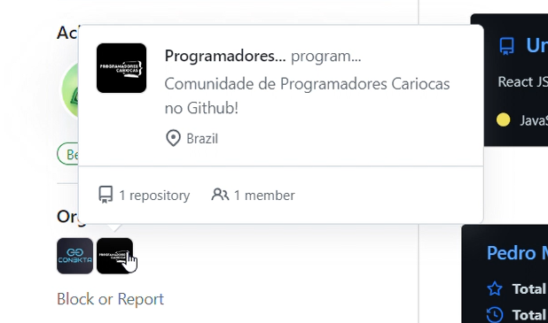
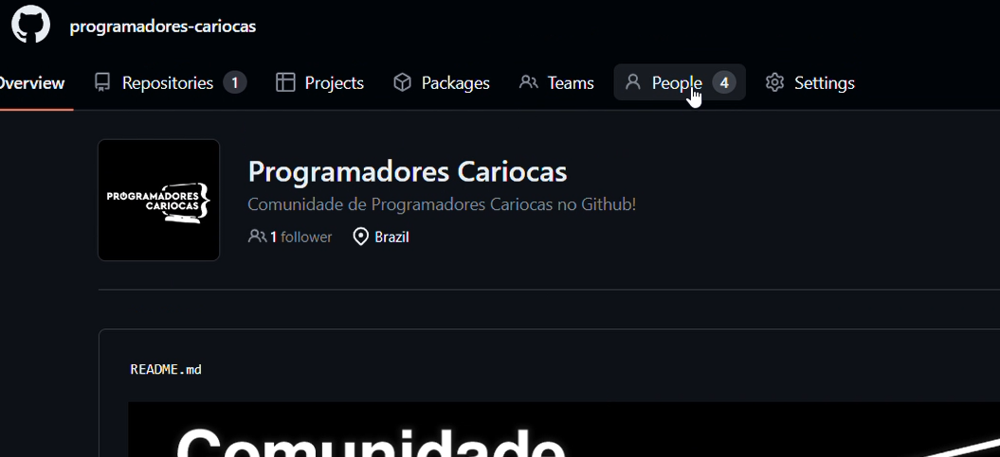
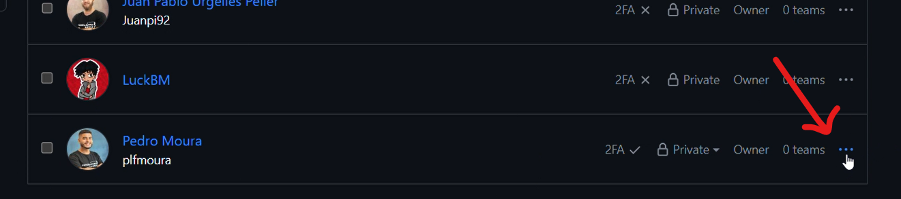
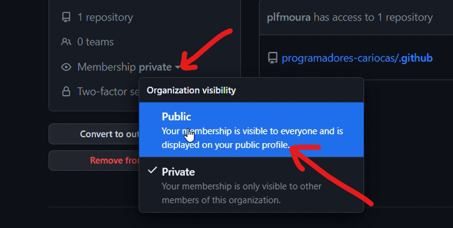
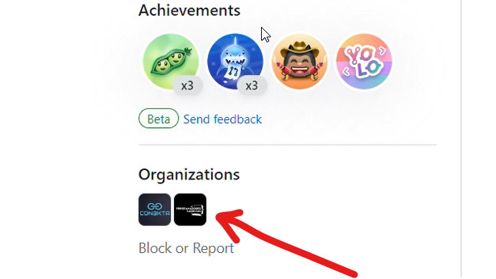

## Exibir emblema da comunidade no Perfil de usuário.

Navegue até a aba "people" e lá você encotrará os usuários da comunidade,

Após encontrar o seu perfil, clique nos três pontos e após em "manage".

No menu lateral a esquerda, procure por "Membership" e mude o status do seu perfil na comunidade de 'private' para 'public'.

Pronto, agora verifique seu perfil.

